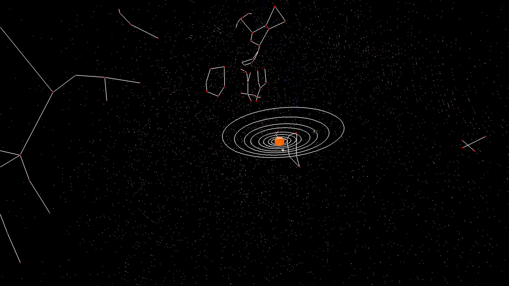

# solar-system-3d

A simple, out-of-scale 3D simulation of the solar system.

## Controls:

**Left stick**: Moves the camera on the horizontal.

**Right stick**: Rotates the camera.

**Touchpad**: Pauses and resumes the simulation.

**Cross**: Enables/disables the display of planetary orbits.

**R1**: Enables/disables sunlight.

**L1**: Enables/disables the display of constellations and the Milky Way belt in shades of blue.

## Stars:

The sky features 7,000 [real stars](stars.txt) visible to the naked eye, mapped from the [SIMBAD Astronomical Database](https://simbad.cds.unistra.fr/simbad/). Their sizes and colors vary according to their magnitude. I used the [Stellarium](https://github.com/Stellarium/stellarium) software to identify the stars that make up each constellation, and the constellation designs are identical to those found in Stellarium.

## Available Constellations:

Currently, the available constellations are: Aries, Gemini, Leo, Scorpius, Pegasus, Andromeda, Orion, Crux, Phoenix, Auriga, Cygnus, Draco, Taurus, Cancer, Virgo, Libra, Sagittarius, Capricornus, Pisces, Aquarius, Canis Major, Canis Minor, Cassiopeia, Ursa Major, Ursa Minor, Lupus, Chamaeleon, Aquila, Hercules and Perseus.

 

## Credits:

- ps5-payload-sdk
